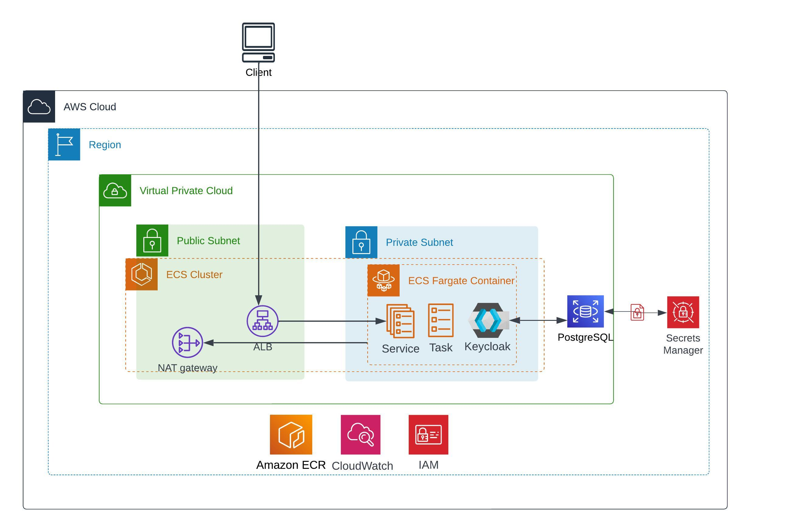
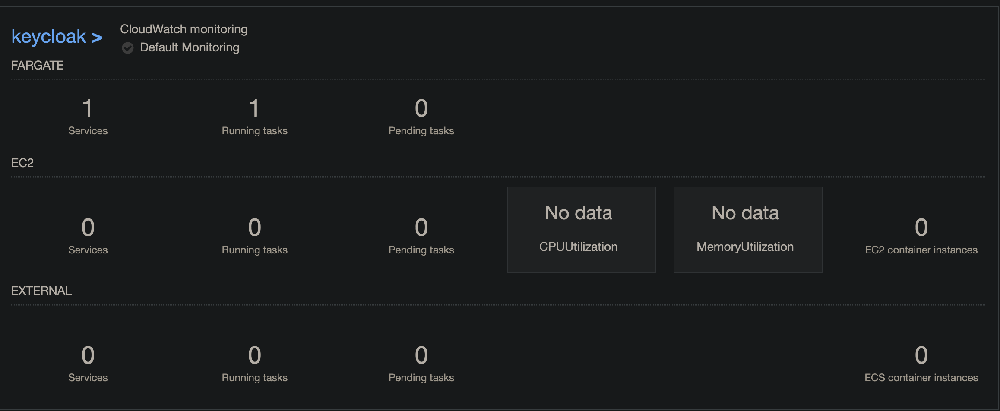
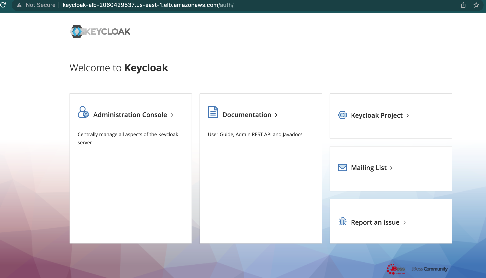

## **Deploy Keycloak using AWS Fargate**
---
> **Keycloak:** Use Keycloak as a user federation, strong authentication, user management, fine-grained authorization, and more.

## Architecture


### **Key Components:** 

- A `virtual private cloud` (`VPC`) configured with public and private subnets, according to AWS best practices, to provide virtual network on `AWS`.
- In the public subnets, managed network address translation (`NAT`) gateways to allow outbound internet access for resources in the private subnets.
- In the private subnets: `Amazon Elastic Container Service` (`Amazon ECS`) tasks running with `AWS Fargate` behind the Application Load Balancer.
- **AWS Fargate:** A service that provides a scalable and managed container environment for deploying Keycloak.
`Amazon Relational database` (`Postgres`) cluster.
- `IAM` role for the Amazon ECS service.
- Secrets from `AWS Secrets Manager` for `Keycloak` console login and database connection.
- **PostgreSQL database:** A service that stores the configuration data for Keycloak.


- **Amazon ECR:** A fully managed container registry offering high-performance hosting, so you can reliably deploy application images and artifacts anywhere.


## **Create a Amazon Elastic Container Registry (ECR) and push your keycloak image on it.**
---
**Retrieve an authentication token and authenticate your Docker client to your registry. For this wse the AWS CLI:**
```
aws ecr get-login-password --region <region> | docker login --username AWS --password-stdin <aws_account_id>.dkr.ecr.<region>.amazonaws.com
```
> **Note:** If you receive an error using the AWS CLI, make sure that you have the latest version of the AWS CLI and Docker installed.

**Build your Docker image using the following command.** For information on building a Docker file from scratch see the instructions here . You can skip this step if your image is already built:
```
docker build -t keycloak .
```
After the build completes, **tag your image** so you can push the image to this repository:
```
docker tag keycloak:latest <aws_account_id>.dkr.ecr.<region>.amazonaws.com/keycloak:latest
```
Run the following **command to push this image** to your newly created AWS repository:
```
docker push <aws_account_id>.dkr.ecr.<region>.amazonaws.com/keycloak:latest
```
#### **Create a task definition:** A task definition is a blueprint for your application's containers, which includes information such as the container image, CPU and memory requirements, environment variables, and networking configuration.

#### **Configure a Fargate cluster:** You need to create a Fargate cluster, which is a logical grouping of Fargate tasks. You can do this using the Amazon ECS console or AWS CLI.

#### **Create a service:** A service is used to manage the deployment and scaling of your Fargate tasks. You can create a service using the Amazon ECS console or AWS CLI.


And, finally deploy keycloak using fargate by running the services created. This service will launch the required number of tasks to run keycloak.

## Output

Fargate Cluster and Service



Keycloak Service



**TODO**
- Terraform state management
- Credentials Rotations
- Monitoring and Logging
- DB backups and rollback mechanism